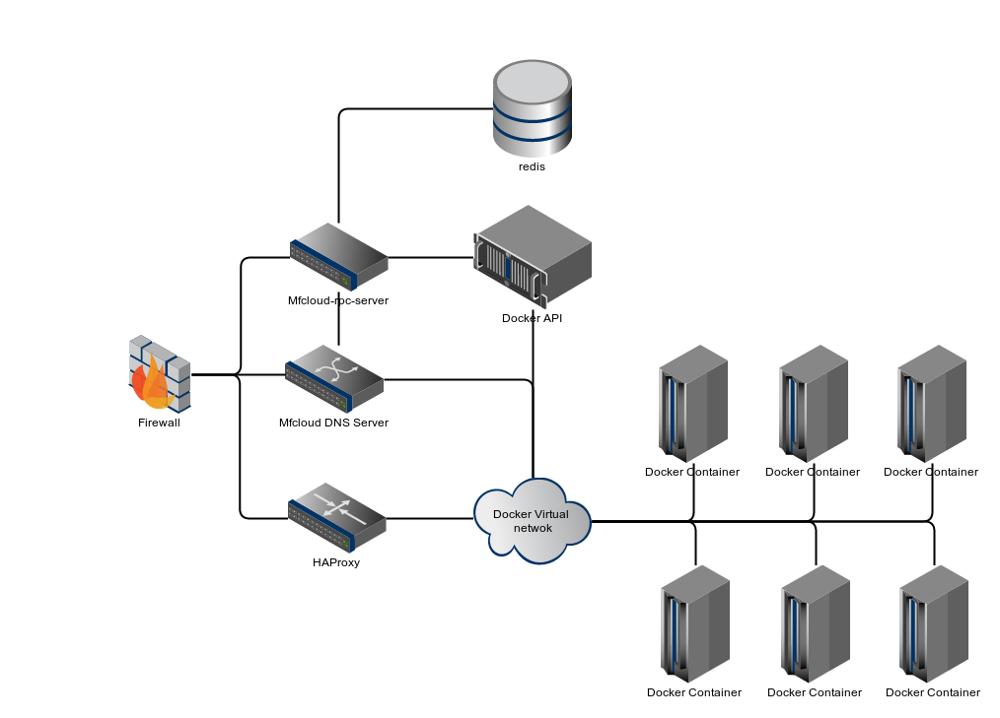

==============
Modera Cloud
==============

Modera Cloud is set of tools that use Docker containers to deploy web-applications to production.

Features
------------------------------------------

 * Configure and test your environment locally (php, mysql, elasticsearch, nodejs, java... anything)
 * Push to cloud in couple commands
 * Live server updates with no downtime
 * Easy data migration between application versions and dev/staging/live environments
 * Fast rollbacks, easy backups

Indices and tables
==================

* :ref:`genindex`
* :ref:`modindex`
* :ref:`search`
