==================================
Deploy mcloud to Amazon AWS
==================================

Amazon AWS is most reliable and flexible of cloud providers. Also
it provides Free Tier program, that allows to try out and run one
EC2 container for free forever.

Create AWS account, open dashboard and go to EC2 section:

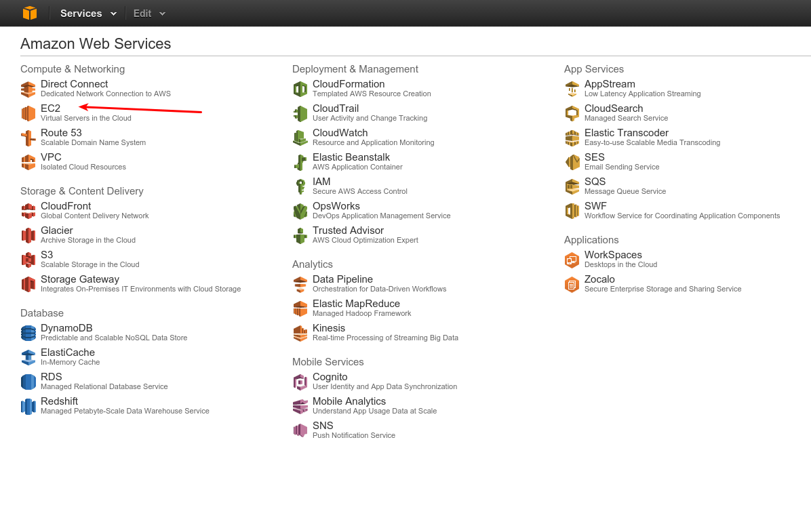

Select region of your choice:

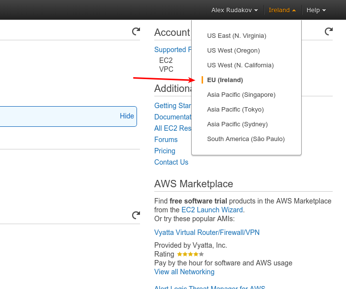

Create and import new keypair:

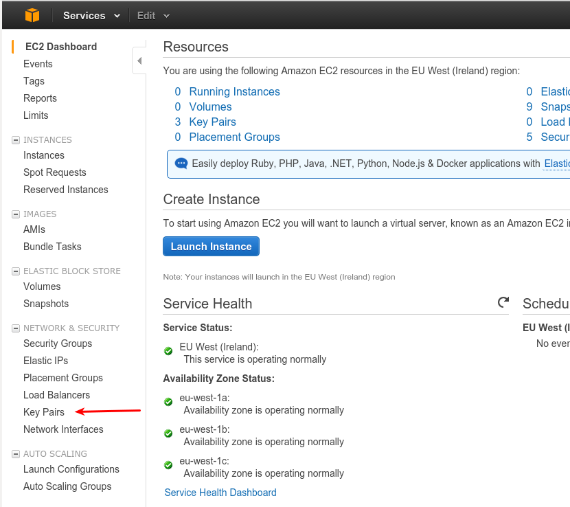

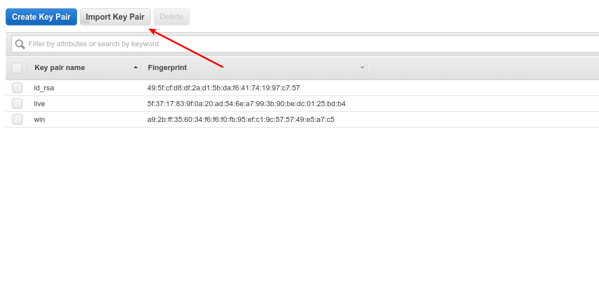

Go to instances section:

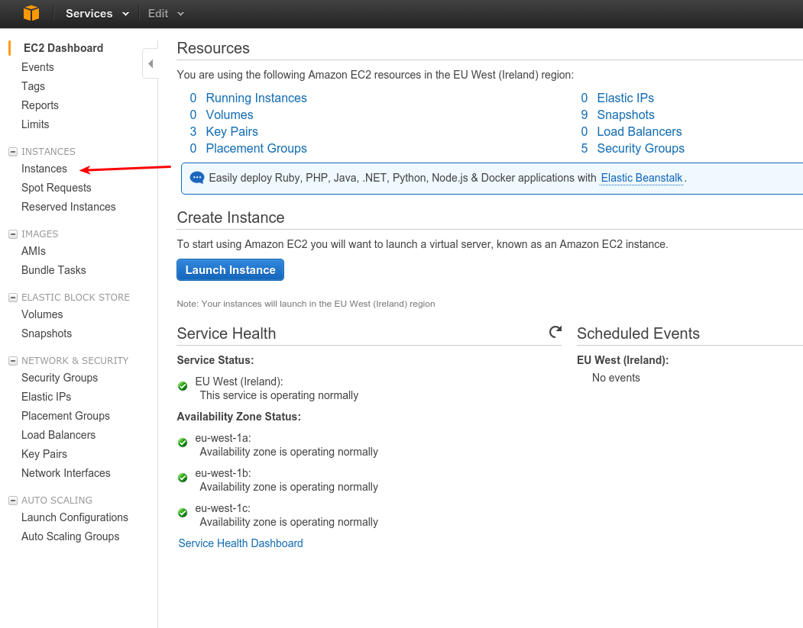

Launch new instance:

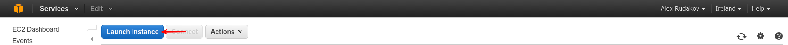

Select Ubuntu 14.04 64 bit, as it best fits to MCloud and also
eligible for AWS Free Tier, so you can use it for free.

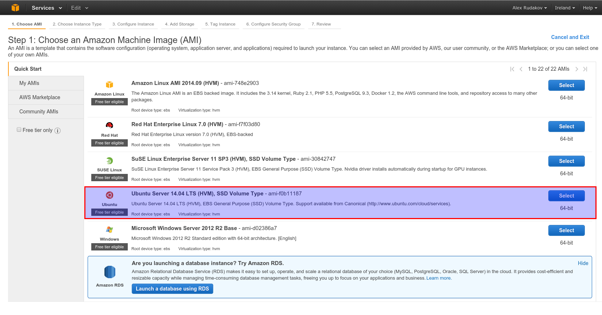

Select instance type. t2.micro is just perfect for MCloud, it's enough to run one
big application. Again t2.micro is ok for Free Tier.

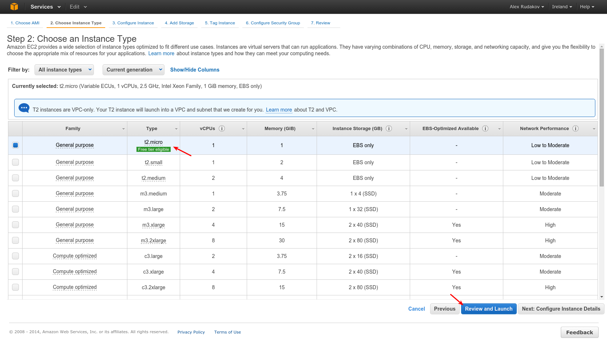

Launch:

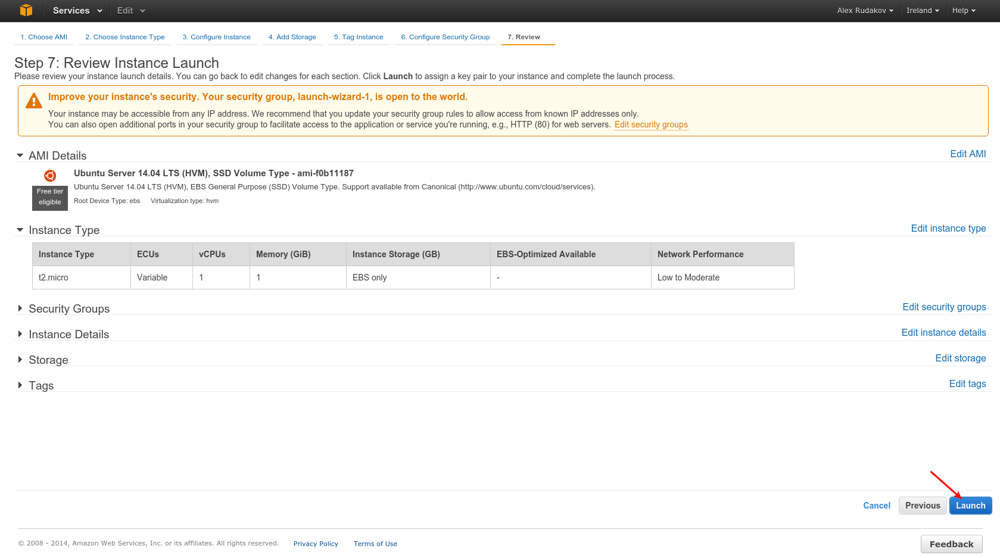

Wizard will ask you ssh key, provded it ssh_key you imported before.

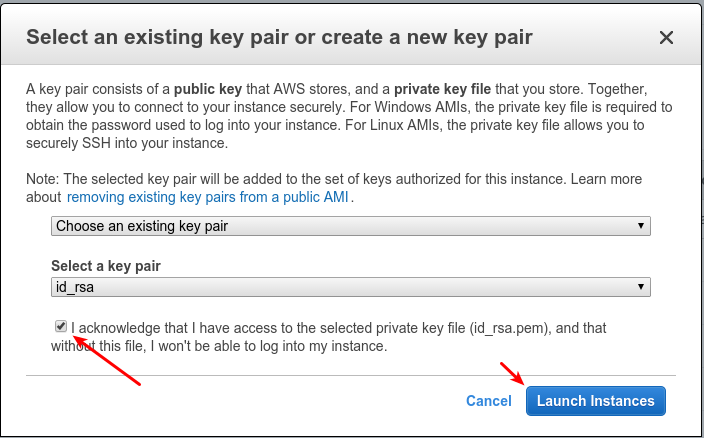

Now proceed to instance list:

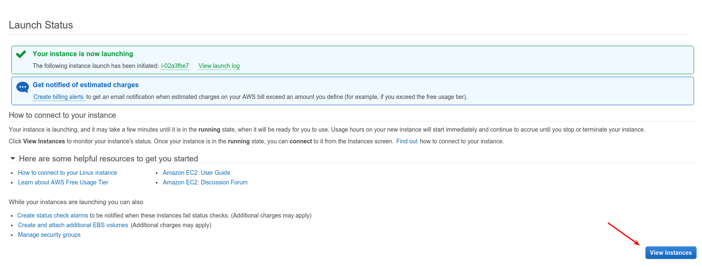

Wait until state changes to "running", and copy ip address of instance:

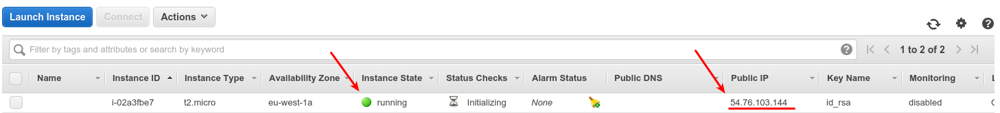

Now we can connect to the instance by ip::

    $ ssh ubuntu@54.76.103.144

    The authenticity of host '54.76.103.144 (54.76.103.144)' can't be established.
    ECDSA key fingerprint is 61:68:4c:aa:89:e9:b3:6e:49:cf:26:8d:73:59:ed:59.
    Are you sure you want to continue connecting (yes/no)? yes
    Warning: Permanently added '54.76.103.144' (ECDSA) to the list of known hosts.
    Welcome to Ubuntu 14.04.1 LTS (GNU/Linux 3.13.0-36-generic x86_64)

     * Documentation:  https://help.ubuntu.com/

      System information as of Fri Oct 17 08:15:19 UTC 2014

      System load: 0.16             Memory usage: 5%   Processes:       82
      Usage of /:  9.7% of 7.74GB   Swap usage:   0%   Users logged in: 0

      Graph this data and manage this system at:
        https://landscape.canonical.com/

      Get cloud support with Ubuntu Advantage Cloud Guest:
        http://www.ubuntu.com/business/services/cloud

    0 packages can be updated.
    0 updates are security updates.

    The programs included with the Ubuntu system are free software;
    the exact distribution terms for each program are described in the
    individual files in /usr/share/doc/*/copyright.

    Ubuntu comes with ABSOLUTELY NO WARRANTY, to the extent permitted by
    applicable law.

    ubuntu@ip-172-30-0-102:~$

And install MCloud::

    $ curl https://mcloud.io/install.sh |sudo sh

    ... lot of output here ...

    ubuntu@ip-172-30-0-102:~$

And make sure MCloud is working::

    ubuntu@ip-172-30-0-102:~$ mcloud

                 888888888                  888                                  88
           88888888888888888                888                                  88
         888             88888     8888888  888    8888888    88     88    88888888
        888   88    888   8888    88        888   88     88   88     88   88     88
      88888  8888   888   8888    88        888  88      88   88     88   88     88
     888888  8888   888   8888    88        888  88      88   88     88   88     88
     888888  8888   888   888     88        888   88     88   88     88   88     88
       8888  8888   888             888888   8     888888      88888888     8888888

    mcloud: ~@me>

