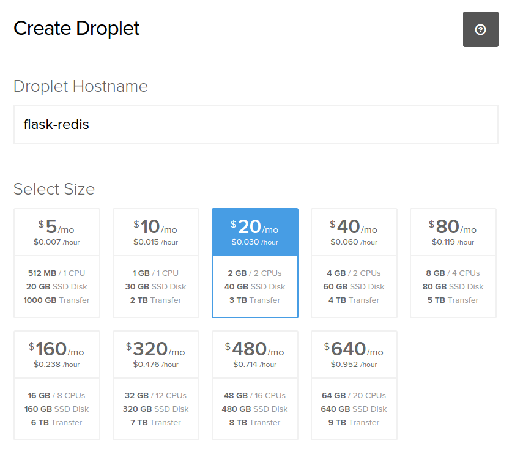
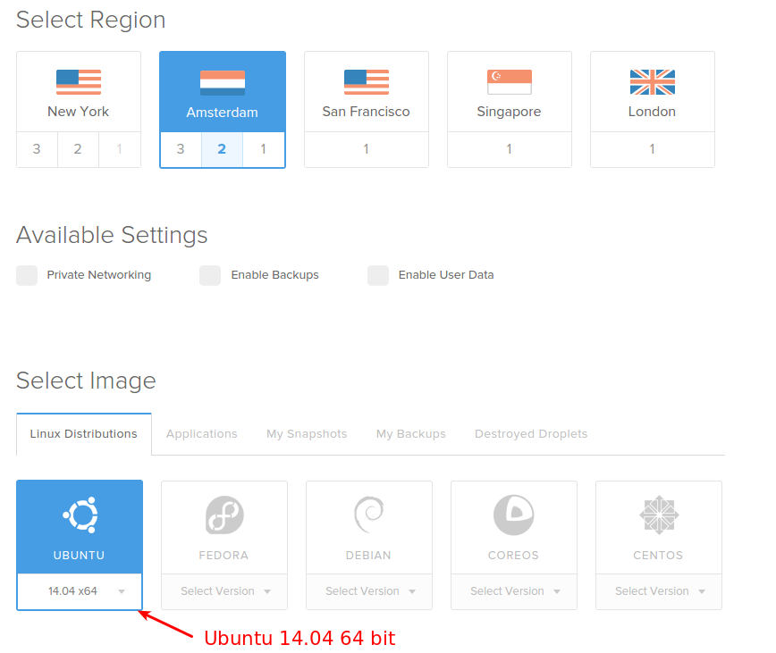
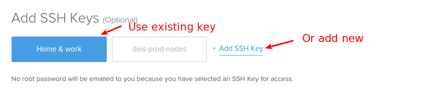
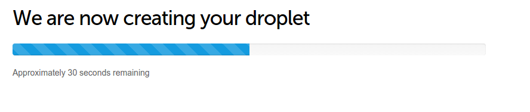
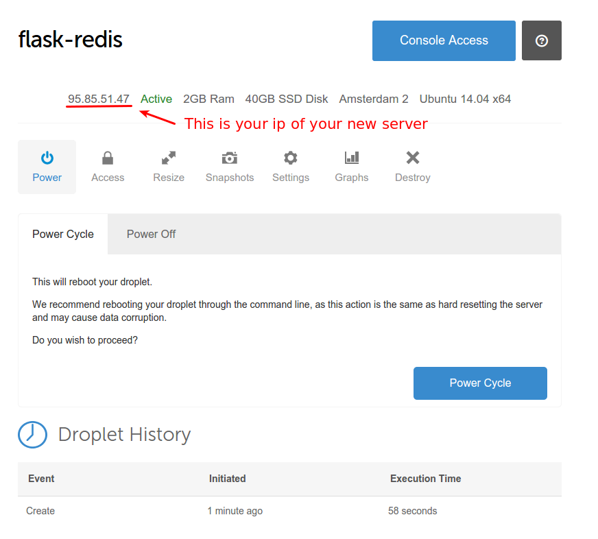

==================================
Deploy mcloud to digitalocean.com
==================================

DigitalOcean is widespread cloud hosing with fast SSD drives.
Let's see how we can deploy mcloud application there.

You need to create a new account on digitalocean.com.

Now we are ready to create a new servver for MCloud:

- Select hostname (any, not really a hostname)
- Select size of container based on your application memory consumption.
  For static site 512MB is perfect, for dynamic application 1GB is sufficient, but
  to deploy several versions of one application (staging, production) 2GB is recommended.

- Region is any on your choice.
- Latest version of Ubuntu 64 bit is just perfect.

Genearete and setup ssh keys for the new container.
`Digitalocean tutorial on ssh keys <https://www.digitalocean.com/community/tutorials/how-to-set-up-ssh-keys--2>`

Ready, set, go!

Waiting until container is created...

And here is ip of your new container:

Lets login there::

    root@flask-redis:~# ssh root@95.85.51.47

    The authenticity of host '95.85.51.47 (95.85.51.47)' can't be established.
    ECDSA key fingerprint is a4:b4:12:fe:7f:7d:f5:2c:cd:c5:93:1c:33:4c:ea:ba.
    Are you sure you want to continue connecting (yes/no)? yes
    Warning: Permanently added '95.85.51.47' (ECDSA) to the list of known hosts.
    Welcome to Ubuntu 14.04.1 LTS (GNU/Linux 3.13.0-32-generic x86_64)

     * Documentation:  https://help.ubuntu.com/

      System information as of Fri Oct 17 03:16:00 EDT 2014

      System load: 0.0               Memory usage: 2%   Processes:       61
      Usage of /:  4.6% of 39.25GB   Swap usage:   0%   Users logged in: 0

      Graph this data and manage this system at:
        https://landscape.canonical.com/

    root@flask-redis:~#

And install mcloud::

    root@flask-redis:~# curl https://mcloud.io/install.sh |sudo sh

    ... lot of output there ...

Check mcloud is there::

    root@flask-redis:~# mcloud

                 888888888                  888                                  88
           88888888888888888                888                                  88
         888             88888     8888888  888    8888888    88     88    88888888
        888   88    888   8888    88        888   88     88   88     88   88     88
      88888  8888   888   8888    88        888  88      88   88     88   88     88
     888888  8888   888   8888    88        888  88      88   88     88   88     88
     888888  8888   888   888     88        888   88     88   88     88   88     88
       8888  8888   888             888888   8     888888      88888888     8888888

    mcloud: ~@me>

